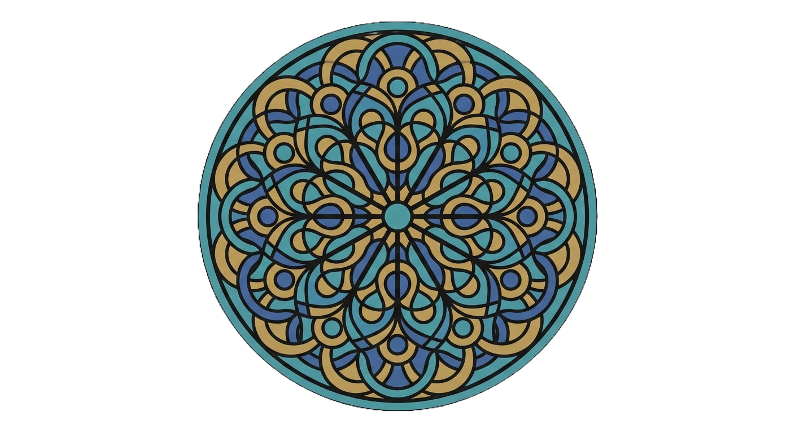
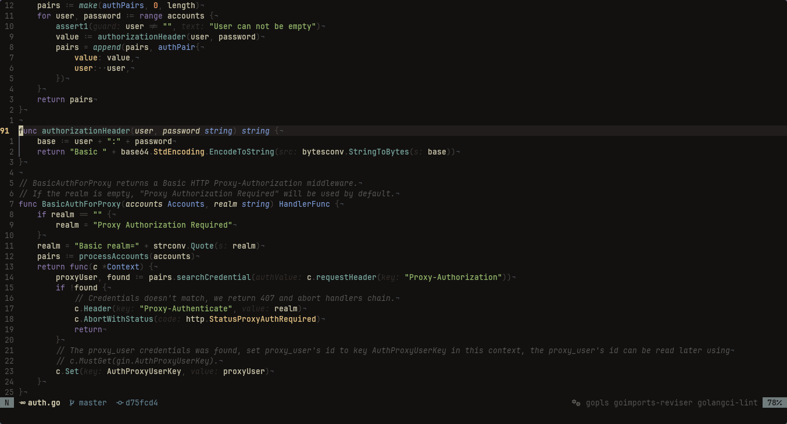
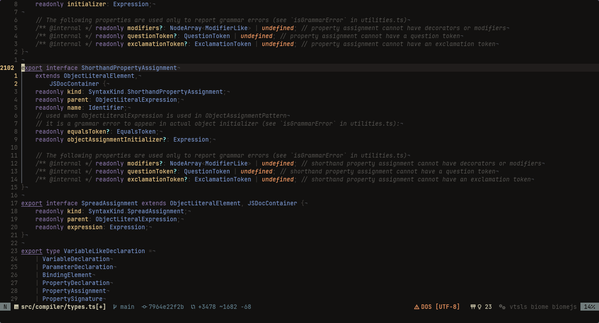
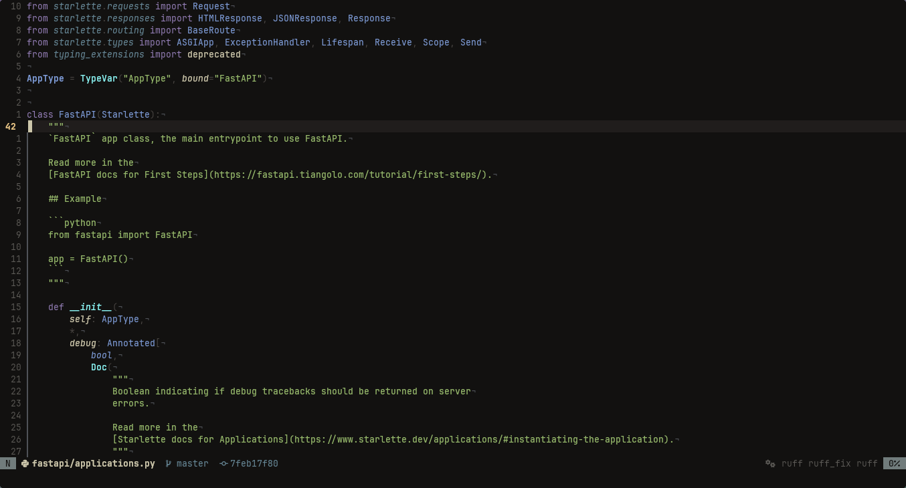

<h1 align="center">VITREA</h1>

<p align="center">
  <em>The architecture of intellectual contemplation. A monastic environment for Neovim forged to silence entropy, comfort the vision, and illuminate pure logic.</em>
</p>

<p align="center">
  <!-- TODO: Insert the Rosette image here -->
  
</p>

> "Chaos and noise are the natural rules of the digital world. Engineering is the monastic imposition of Order. VITREA is the architecture of Silence."
>
> **— ORDO ET SILENTIUM**

## I. An Invocation to Silence (The Prologue)

Dear artisan, if your steps have led you to these gates, it is probable that your fovea is exhausted. We share in this exact fatigue.

For years, we have navigated a digital ecosystem fractured by visual entropy. Modern development environments frequently treat the screen as a feverish marketplace, filling every available pixel with neon colors, clashing warnings, and artificial boundaries. This *horror vacui*—the dread of empty space—exhausts the intellect and scatters the attention. We understood that our cognitive fatigue was not a failure of the intellect, but an ontological corruption of our tools. The true Intellectual Life demands a sanctuary.

We did not aspire to forge a mere "theme"; we yearned for a refuge. We turned our eyes to the master builders of the great cathedrals of the High Middle Ages. They understood that a space dedicated to profound labor must be ordered, proportional, and immersed in silence. Thus, **VITREA** was conceived.

VITREA is an invitation to walk with us toward a more deliberate and serene path of forging systems. It is an environment founded upon the classical principles of the *Trivium* (the grammar of syntax, the logic of execution, and the rhetoric of presentation) and the *Quadrivium* (the mathematics and optical physics of proportion), translated into the language of modern compilers. We invite you to rest your vision, silence your intellect, and rediscover the formidable beauty of Aristotelian logic.

---

## II. The Universal Grammar (Architecture in Praxis)

In classical education, the first path of the *Trivium* is Grammar—the profound comprehension of structural rules before dialectics are even applied. The VITREA engine does not merely tint texts; it dissects the Universal Grammar of your code through the precise scalpel of the Abstract Syntax Tree (Tree-sitter).

Whether you are orchestrating concurrent systems in Go, forging memory-safe abstractions in Rust, or mapping generic matrices in TypeScript, the engine imposes the exact and unyielding *Ordo et Silentium*. The visual hierarchy remains absolute across all dialects.

<p align="center">
  <!-- TODO: Insert the main Golang image here -->
  
</p>
<p align="center">
  <em>The Vesper State illuminating the backend architecture. Passive structures recede into Lapis; the active intellect advances in Gold.</em>
</p>

We cordially invite you to examine how our architectural dogmas subjugate the structural chaos of other ecosystems:

<details>
<summary><b>❖ Contemplate the Rust Forge (Memory Safety & Traits)</b></summary>
<br>
<p align="center">
  <!-- TODO: Insert the Rust image here -->
  
</p>
<p align="center">
  <em>Observe how the dense syntax of lifetimes and punctuation is pacified within the shadows of Abbey Dust, permitting the strict logic of ownership to breathe.</em>
</p>
</details>

<details>
<summary><b>❖ Contemplate the TypeScript Matrix (Generics & Interfaces)</b></summary>
<br>
<p align="center">
  <!-- TODO: Insert the TypeScript image here -->
  
</p>
<p align="center">
  <em>Complex unions and structural generics recede harmoniously into Fresco Lapis, preventing the foveal exhaustion inherent to web ecosystems.</em>
</p>
</details>

<details>
<summary><b>❖ Contemplate the Python Flow (Dynamic Logic)</b></summary>
<br>
<p align="center">
  <!-- TODO: Insert the Python image here -->
  
</p>
<p align="center">
  <em>In the absence of rigid bounding braces, the structural void becomes sovereign. The active intellect is guided purely by the luminance of Tabernacle Gold.</em>
</p>
</details>

---

## III. The Revelation of the Name: VITREA

In the Latin tongue, *Vitrea* signifies stained glass.

When an observer stands within the nave of a cathedral, the raw, blinding light of the outside world does not strike their pupils directly. It is intercepted by the stained glass, refracted, and transmuted into meaning, narrative, and organic warmth.

This is the exact office that our Lua engine exercises upon your code. It captures the aggressive syntax of language servers (LSP) and filters it mathematically. It pacifies the clamorous glare of errors and subjugates the passive masonry, permitting only the *Telos*—the executable purpose that your code narrates—to radiate with clarity and grace.

---

## IV. The Dogmas of Optical Charity

Saint Thomas Aquinas postulated that true beauty demands three conditions: *Integritas* (wholeness), *Consonantia* (harmonic proportion), and *Claritas* (radiance or clarity). We have applied these exact philosophical demands to our architecture in an act of profound charity toward the physiology of the engineer.

### 1. Consonantia (Harmonic Proportion)

Color is not a decorative accident; it is the mathematics of light destined to guide, not to distract.

* **The Structural Masonry (Potency):** Types, interfaces, and control flow form the immutable base of your logic. Optically, they recede into cold tones, providing firm sustenance without demanding the sacrifice of your immediate attention.
* **The Active Intellect (Act):** Properties and methods are the *actus purus* of the system. They advance gently to the foreground, allowing the eye to trace the flow of data instinctively.

### 2. Integritas (The Carthusian Void)

To achieve wholeness, it is imperative to extirpate the superfluous. Punctuation—the syntactic mortar—is suppressed into dense, warmed shades of gray. The frames and borders of floating windows are dissolved. We offer you a *Carthusian* environment of absolute silence, where your logic floats unimpeded over a monolith of obsidian.

### 3. Apatheia (The Pacification of Failure)

Modern editors vociferate against the developer through intrusive virtual texts. VITREA invites the editor to a state of *apatheia*—the serene impassibility of the spirit. We pacify the LSP diagnostics, converting neon shouts into warnings of an oxidized, contained blood, honoring the dignity of the correction without rupturing your contemplative peace.

---

## V. The Physiological Table (The 14 Pillars of the Abbey)

Every hexadecimal foundation in VITREA was distilled through rigorous studies of optical physics. No color was added by chance; the palette finds its perfect *Integritas* in 14 canonical stones, categorically separating the material world (runtime) from the creator plane (compile time).

|   | Nomenclature | Hex | Syntactic and Logical Mapping (AST) | Philosophical and Optical Purpose |
| :---: | :--- | :--- | :--- | :--- |
|  | **Obsidian Nave** | `#121110` | Primary manuscript background. | The visual acoustic silence. Eradicates digital claustrophobia through the absorption of light. |
|  | **Cloister Shadow** | `#262423` | Pickers, floats, and stealth Inlay Hints. | The contained elevation. Separates UI contexts without breaking the void with rigid boundaries. |
|  | **Parchment Linen** | `#CDC7AB` | Standard text, common variables. | The oxidized bone-white. Acts as the neutral subject of the logical premise, preventing retinal halation. |
|  | **Fresco Lapis** | `#7E9CD8` | Types, Interfaces, and Primitives. | The cold stone. Recedes structural foundations, supporting the intellect without fatiguing it. |
|  | **Bishop Amethyst**| `#957FB8` | Control flow (`if`, `for`, `return`). | The dialectical Copula. Directs the flow of logical reasoning without the vulgar weight of bold text. |
|  | **Abbey Dust** | `#3E3A38` | Punctuation, operators, separators, and braces. | The abbey dust. Pushes syntactic mortar to the subliminal periphery of perception. |
|  | **Sacrament Rose** | `#B88498` | **Meta-Syntax:** Macros, Decorators, Regex, Escapes. | The compiler's intercession. A dusty magenta, complementary reverse of organic green, isolating the creator sub-language without blinding the vision. |
|  | **Incense Smoke** | `#65737E` | **The Ethereal Text:** Virtual text, ghost completions, and ephemeral LSP injections. | The ethereal presence. A cold, diffuse slate that materializes temporary compiler suggestions without physical weight, vanishing as swiftly as smoke. |
|  | **Tabernacle Gold**| `#E6C384` | Properties, object fields, state keys. | The bonfire of the intellect. Supreme luminous refraction that magnetizes foveal tracking. |
|  | **Copper Patina** | `#7AA89F` | Standardized functions and methods. | The mechanical act. A mid-tone kinetic energy that guides the eyes along the call graph. |
|  | **Olive Gethsemane**| `#98BB6C` | Organic textual strings. | The physiological rest. Seated at the peak of foveal sensitivity (555nm) for instantaneous muscular relief. |
|  | **Vigil Candle** | `#FFA066` | Booleans, constants, and `nil`/`null`. | The amber heat that signals instants of deliberation or absolute state mutation. |
|  | **Martyr Blood** | `#C34043` | Severe LSP diagnostics and logical errors. | The oxidized blood. Banished from common syntax; manifests solely to dictate an unpostponable correction of course. |
|  | **Scribe's Jade** | `#2B3328` | Addition background (Git Diff). | Desaturated moss for the silent and uninterrupted reading of long addition scrolls. |
|  | **Heretic's Ash** | `#3D2B2E` | Deletion background (Git Diff). | Crimson ash to signal the extirpation of code that no longer serves the Order. |

---

## VI. The Integration of the Void (User Interface)

A true monastic engine must not create new and profane colors to adorn the interfaces of explorer plugins (`snacks`, `mini.files`, etc.). Such an act would be yielding to the noise we swore to combat.

VITREA subjugates the entire Neovim ecosystem through the Doctrine of Containment:

* **Boundless Frontiers:** Floating boxes rest upon the tenuous elevation of the *Cloister Shadow*, extirpating the lines that mutilate the workspace.
* **Silent Footers:** Status lines renounce corporate glare and adopt the absolute obscurity of *Abbey Dust*, presenting metadata as faded monuments that respond only when inquired.
* **Stealth Hints:** The compiler's Inlay Hints are not painted in warning tones; they meld into the relief of the background, assuming the form of true stealth UI.

---

## VII. Installation and Liturgical Vows

If our philosophy reverberates with your pursuit of excellence in engineering, we fraternally invite you to profess the vows of focus. Integrating the VITREA engine into your Neovim ecosystem is an act of abnegation of distractions.

### [Lazy.nvim](https://github.com/folke/lazy.nvim)

```lua
{
    "jerryaugusto/vitrea.nvim",
    lazy = false,
    priority = 1000,
    opts = {
        -- We grant the transmutation of liturgical hours according to the weariness of the sun.
        liturgy = "vesper", -- "matina" | "vesper" | "vigil"
    },
    config = function(_, opts)
        -- The Vow of Tabula Rasa: to purify the memory before laying the foundations.
        vim.cmd("highlight clear")
        vim.cmd("syntax reset")

        require("vitrea").setup(opts)
        vim.cmd("colorscheme vitrea")
    end,
}
```

---

## VIII. The Scriptorium (Contributions)

In the imposing abbeys of classical antiquity, the *scriptorium* was the consecrated room where manuscripts were zealously transcribed, illuminated, and safeguarded against time. We consider this repository our digital scriptorium, and its doors are open to all intellectuals who share our devotion to the craft of software.

If you wish to submit enhancements to the VITREA engine, we shall receive your contribution with Aristotelian charity. We strictly demand only that your Pull Requests rigidly obey our foundational rule: **Ordo et Silentium**. Every geometric or chromatic addition must be weighed upon the scales of cognitive load; it must obligatorily impose structural rigor or expand the monastic void.

---

## IX. The Sharing of Light (License)

True dialectical knowledge only achieves its purpose when shared. The foundation of VITREA is offered freely to the intellectual community under the **MIT License**. Feel fully authorized to gather these fourteen stones, study our harmonic proportions, and construct, upon them, your own sanctuary of contemplation.

---

<p align="center">
  <em>Chaos and noise are the natural rules of the digital world. Engineering is the monastic imposition of Order. VITREA is the architecture of Silence.</em><br><br>
  <strong>— ORDO ET SILENTIUM —</strong>
</p>
