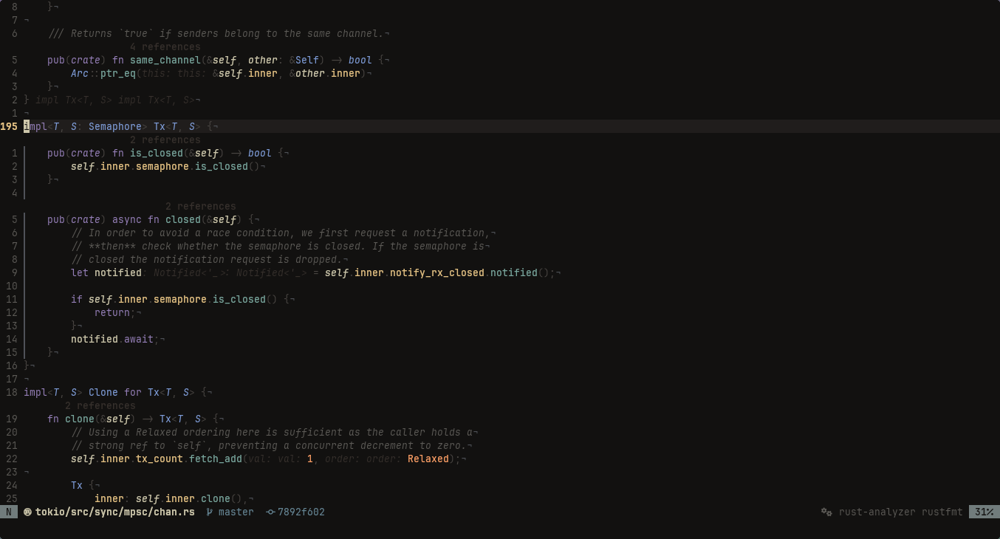

<p align="center">
  
</p>

<h1 align="center">V I T R E A</h1>

<p align="center">
  <em>Ordo et Silentium. The Architecture of Silence and Contemplation.</em>
</p>

<p align="center">
  <a href="https://neovim.io/"></a>
  <a href="https://lua.org"></a>
  <a href="#-the-liturgical-hours"></a>
</p>

---

> *"The sensation of typing within Vitrea is that of studying under the light of a single candle in a closed scriptorium."*

VITREA is not a mere "colorscheme". It is a visual containment engine—a sanctuary architected under the structural principles of High Middle Ages cathedrals and the chiaroscuro physics of Caravaggio. It is engineered specifically for backend developers (Golang, Rust) who seek deep focus through the methodology of *The Intellectual Life*.

Modern development environments suffer from *horror vacui* (the fear of empty space), filling every pixel with saturated neon colors, artificial borders, and plastic cybernetics. VITREA annihilates this noise. We have eradicated synthetic light in favor of physical materiality: raw linen, crushed stone, unbleached parchment, and oxidized minerals.

## 🏛 The Visual Showcase

<p align="center">
  
  <!--  -->
</p>
<p align="center">
  <em>The Alchemy of Vesper: Demonstrating the eradication of synthetic aesthetics in favor of tactile depth and optical charity.</em>
</p>

## ⚙️ Engineering Dogmas

VITREA was forged to be an elite product in performance and stability, sustained by three immutable dogmas of software:

1. **Zero Latency (Cache Stasis):** Unlike traditional themes that process extensive tables at every startup, VITREA features an embedded compiler (`compiler.lua`). Upon the first execution, it fuses all UI, Tree-sitter, and LSP rules into static LuaJIT Bytecode instructions. The result is a mathematically proven startup time of **< 1 millisecond**.
2. **The Doctrine of Containment:** No color outside the canonical pillars may cross the editor's gates. Standard ANSI reds and greens are strictly intercepted by the global `muzzle.lua`, ensuring integrated terminals inherit the optical matrix. Third-party UI tools (`blink.cmp`, `snacks.picker`, `mini.files`) are stripped of artificial borders and forced into seamless, borderless integrations using native `WinBlend`.
3. **Dynamic Optical Physics:** For infinitesimal UI adjustments, `optics.lua` utilizes strict alpha interpolation against absolute light or absolute vacuum at compile-time, keeping the core hex table immaculate.

## 📥 Installation

VITREA demands Neovim 0.12.0+ (Nightly) to leverage the most advanced native Lua APIs. It provides absolute peace with **zero configuration required**, intelligently detecting and adapting to your ecosystem out of the box.

Using [lazy.nvim](https://github.com/folke/lazy.nvim):

```lua
{
    "jerryaugusto/vitrea.nvim",
    lazy = false,
    priority = 1000,
    opts = {
        -- We grant the transmutation of liturgical hours according to the weariness of the sun.
        liturgy = "vesper", -- "matina" | "vesper" | "vigil"

        -- VITREA operates perfectly with zero configuration.
        -- However, for the architects who demand absolute control:
        integrations = {
            blink_cmp = { enabled = true },
            mini      = { enabled = true },
            snacks    = { enabled = true },
        }
    },
    config = function(_, opts)
        require("vitrea").setup(opts)
        vim.cmd.colorscheme("vitrea")
    end,
}
```
*To regenerate the LuaJIT bytecode cache after modifying options, execute `:VitreaCompile`.*

---

## 🧱 The Aesthetic Audit: Forging the Canon

To comprehend the *Vesper* palette is to understand our categorical refusal to accept industry standards. In our pursuit of elevating software engineering to High Culture, we subjected traditional IDE design to a brutal visual and philosophical audit.

We recognized that modern interfaces are governed by a cowardly "muscle memory." We became accustomed to neon, synthetic hues, "hacker green," and "cyberpunk cyan" simply because the cathode-ray tubes of the past conditioned us to them—plastics and lasers disguised as tools for focus. To reflect *Ordo et Silentium*, we banished the synthetic and embraced the organic. Each of our 17 canonical pillars ceased to be a light-emitting hex code; they are treated as physical pigments, crushed against stone, reacting to the penumbra.

### I. The Tenebrist Foundation (The Void & Silence)

Caravaggio's physics of light dictates that darkness is not the absence of color, but a protective, welcoming presence. The background of your editor is not an empty canvas; it is the air of the cloister.

| Liturgical Stone | HEX Code | Ontological Function & Materiality |
| :--- | :--- | :--- |
|  **Obsidian Nave** | `#161514` | **Global Background.** We rejected generic blue-grey "night modes" to forge the true Void. An abyssal black with microscopic earthly warmth, meticulously calculated to absorb optical fatigue and eradicate astigmatism-inducing glare. |
|  **Midnight Rain** | `#1A1918` | **Stealth UI.** A millimetric step of light above the Obsidian Nave to accommodate inactive terminals and status bars. This invisible mortar allows us to apply the Doctrine of Containment, separating UI from code using the physical thickness of shadows rather than drawn borders. |
|  **Cloister Shadow** | `#262423` | **Line Numbers.** The borders of your code should never scream for attention. This shade provides a gentle, tactile anchor that completely vanishes into your peripheral vision the exact second your fovea locks onto the syntax. |

### II. Potency & Mortar (The Passive Structure)

In Thomistic thought, *Potency* is the capacity to be, not the action itself. Code foundations and base syntax must strictly retreat to prevent the infamous *horror vacui*.

| Liturgical Stone | HEX Code | Ontological Function & Materiality |
| :--- | :--- | :--- |
|  **Abbey Dust** | `#3E3A38` | **Delimiters (@punctuation).** The invisible mortar. Drastically flattening the luminance of braces, brackets, and commas was our greatest triumph against cognitive fatigue. The code breathes, sinking into the Z-axis. |
|  **Martyr's Ash** | `#8C8A85` | **Types & Interfaces (@type).** Flat, stoic mineral ash. In architectural languages (Go, Rust), types do not act; they establish laws. They sit passively behind the variables they govern. |
|  **Veil Silver** | `#5A5856` | **Ghost Text / Inlay Hints.** Purely speculative potency—code that does not yet exist in reality. Carefully restrained below a 4.5:1 contrast ratio, ensuring algorithmic suggestions never compete with materialized logic. |
|  **Incense Smoke** | `#65737E` | **Visual Selection (CursorLine).** We avoided translucent blues that profane the original syntax. This mid-luminance grey does not alter the hue of the code; it merely elevates it physically toward you, providing an unmistakable tactile step. |

### III. The Organic Flesh (The End of Synthetic Lies)

Code at rest must possess physical weight, not electrical glare. Here, we redeemed ourselves from the industry's aesthetic cowardice.

| Liturgical Stone | HEX Code | Ontological Function & Materiality |
| :--- | :--- | :--- |
|  **Scriptorium Parchment** | `#D8D2C4` | **Variables (@variable).** We rejected the retina-burning pure white of illuminated screens. Variables rest in a warm, desaturated, aged white, physically simulating parchment for endless hours of reading. |
|  **Vellum Linen** | `#B4A894` | **Parameters (@parameter).** Raw linen texture. A subtle, organic drop in luminance that instinctively whispers to the brain that the data is a foreign body, completely eliminating the need for chromatic alarms. |
|  **Patina Verdigris** | `#5E7B74` | **Booleans & Constants.** The death of cyberpunk cyan. To represent absolute, immutable truth, we employed Verdigris—the classic, lethargic oxidation of copper. Cold enough to indicate immutability, yet firmly carved in mineral stone. |
|  **Malachite Dust** | `#7B8770` | **Strings (@string).** The explicit purge of "hacker green". Strings are literal human literature embedded in the machine. Crushed malachite and dehydrated sage honor the 555nm physiological optical peak, but do so with mature, earthy weight. |

### IV. Act & Action (The Foveal Hierarchy)

When the system moves, foveal vision must be hijacked instantly, but with elegant, liturgical grace.

| Liturgical Stone | HEX Code | Ontological Function & Materiality |
| :--- | :--- | :--- |
|  **Tabernacle Gold** | `#D3A75B` | **Properties & State Mutation.** The highest chromatic luminance of the palette. State mutation is the source of all systemic complexity; the Gold tears through the chiaroscuro, unapologetically forcing your optical macula to track the flow of data. |
|  **Woad Indigo** | `#4B6C82` | **Functions & Methods (@function).** The engine of action. A dense, retreating oxidized indigo. It explicitly signals where action occurs but gracefully surrenders the crown of foveal contrast to the Gold. Deeply noble, yet recessive. |
|  **Sacrament Rose** | `#A5707B` | **Control Flow (if, return).** Faded ecclesiastical magenta. Control flow must never trigger a vibrant alarm. This rose establishes a visual cadence—a silent metronome guiding your eye through logical branches with rhythm, not anxiety. |

### V. Friction & Metasyntax (The Weight of Danger)

Complex systems bleed under pressure. The palette must signal structural risk by communicating gravity and heat.

| Liturgical Stone | HEX Code | Ontological Function & Materiality |
| :--- | :--- | :--- |
|  **Censer Terracotta** | `#A86F50` | **Macros & Metasyntax (@operator).** Burned earth. Reserved for compiler directives, raw pointers, and global state. The code bleeds with an ancient, terrestrial heat, warning the architect of deep structural manipulation. |
|  **Vesper Amber** | `#B98448` | **Diagnostic Warnings.** Autumnal amber. Indicates architectural friction or code smells without ever invoking the sympathetic nervous system's fight-or-flight response. |
|  **Relic Vermilion** | `#A94A42` | **Diagnostic Errors.** Oxidized blood dried on a relic. We repudiate the cardinal red of generic IDEs that shatters vision. The gravity of a broken application demands absolute, solemn respect and total silence, not strident neon. |

---
<p align="center">
  <em>For architectural contributions or to report a breach in containment, please consult the <a href="CONTRIBUTING.md">Scribe's Guidelines</a>.</em>
</p>
